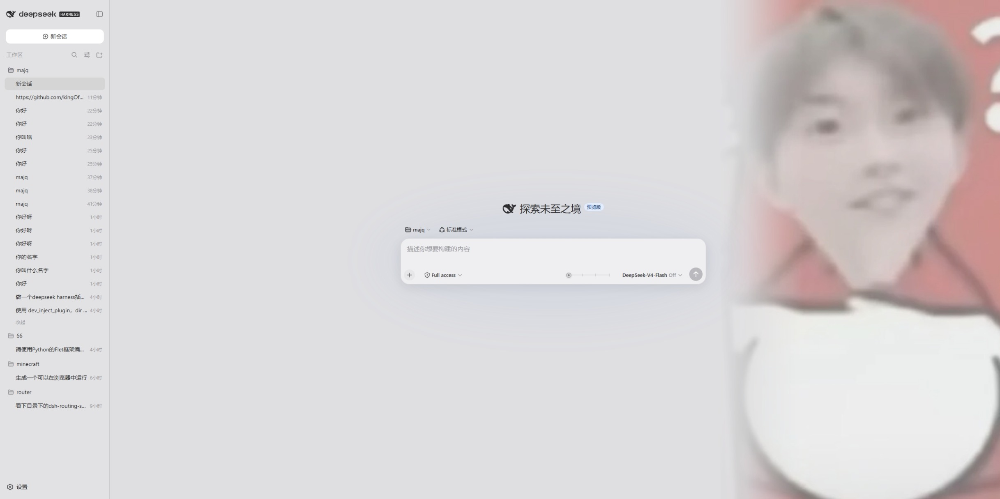
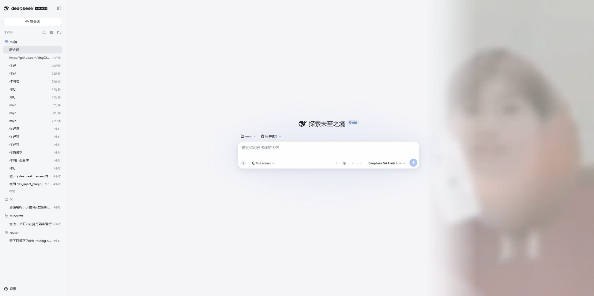
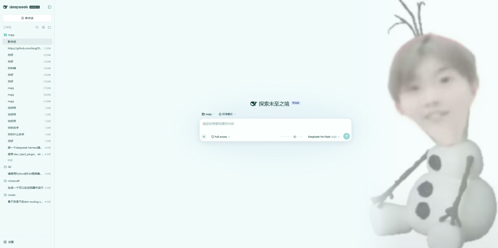
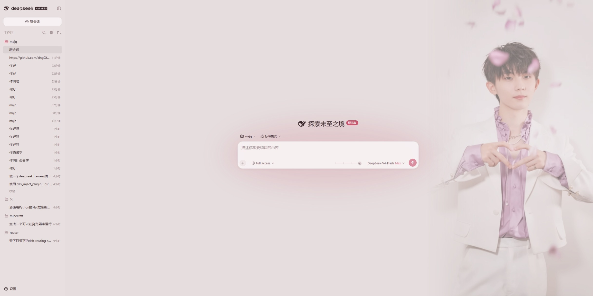

# 马加七皮肤 · DeepSeek Harness 四档爆改版

一个 [DeepSeek Harness](https://github.com/deepseek-ai/deepseek-harness) Web 端客户端皮肤插件：把推理等级滑块爆改成**四档"图 + 界面配色 + 人设"三位一体**的形态。基于 [kingOfSoySauce/dsh-liang-skin](https://github.com/kingOfSoySauce/dsh-liang-skin)（"滑动变祖"）改造。

## 四档一览

| 档位 | 强度轴 | 档位图 | 界面主题 | 人设 |
| --- | --- | --- | --- | --- |
| off | 0 | `screenshot-off.jpeg` | 整体灰色 | 极度油腻恶心 · 土味情话机器 |
| low | 10 | `screenshot-low.jpeg` | 蓝色（原版 Harness 观感） | 贫嘴油腻 · 耍帅接梗 |
| high | 20 | `screenshot-high.jpeg` | 亮青色 | 清爽精英 · 不动声色地撩 |
| max | 30 | `screenshot-max.jpeg` | 粉色 `#E6DDDE` + 玫瑰粉强调 | 霸道总裁 · 强势宠溺 |

- 模型有几个推理档位就均匀落在 0–30 强度轴上就近吸附；不支持的模型不显示滑块。
- 滑块提示只显示档位本名（Off / Low / High / Max）。
- 全部按钮（新对话、发送、设置齿轮等）跟随当前档位强调色。

## 截图

| off（灰） | low（蓝） |
| --- | --- |
|  |  |
| **high（亮青）** | **max（粉）** |
|  |  |

## 隐形人设注入

人设不写进用户消息：客户端只把当前档位静默上报到插件自有的 HTTP 接口，服务端通过
DeepSeek Harness 的 `systemPrompt.context()` 把对应人设文本注入系统提示词。
因此**用户消息气泡、聊天界面与会话历史里完全看不到任何指令文本**，模型行为却随档位变化。

- 全档位恒定：模型自称「马加7」，并把用户当作女孩子对待。
- 内置合规护栏：不生成露骨色情内容、不侮辱或威胁任何人、不涉及未成年人。
- 设置 → 外观区域的「档位人设」开关可随时关闭（关闭后服务端不再注入）。

## 背景深度调节

外观区域提供「背景深度」滑块（0–100%，步进 5），实时缩放右侧档位图/背景的不透明度，
数值即时显示并持久化在浏览器本地。

## 安装

> 安装前建议关闭其他已启用的皮肤插件，避免冲突。

### 方式一：本地 tgz（推荐，含你的自定义素材）

```sh
cd dsh-liang-skin
dsh plugin --profile web add ./dsh-client-majia7-skin-<版本>.tgz
```

### 方式二：从本仓库安装（需仓库为 Public）

```sh
dsh plugin --profile web add 'github:Carlown/majia7-dsh-skin'
```

### 方式三：克隆后从本地路径安装（开发迭代）

```sh
git clone https://github.com/Carlown/majia7-dsh-skin.git
cd majia7-dsh-skin
npm install && npm run build
dsh plugin --profile web add .
```

链接依赖模式下改完源码只需 `npm run build` 并重启 DSH 即可生效。

## ⚠️ 皮肤市场用户注意

如果你同时安装了皮肤市场（dsh-skin-market）：**不要在市场里对本皮肤点"安装/切换"**——
市场会把本插件重置回 github 上游原版，覆盖掉四档素材与人设。被覆盖后的恢复方式：

```sh
dsh plugin --profile web remove dsh-client-majia7-skin
dsh plugin --profile web add ./dsh-client-majia7-skin-<版本>.tgz
```

## 生效与验收

安装/更新后重启 DSH（终端 Ctrl+C → `dsh web`）。纯客户端改动刷新页面即可；
涉及 `src/index.js`（服务端人设通道）的改动必须重启。

验收清单：

1. 拖动滑块：四张档位图与四套界面配色同步切换；
2. 发消息：模型自称「马加7」、把用户当女生、风格随档位（off 油腻 / max 霸总），且消息气泡里没有任何指令文本；
3. 设置 → 通用设置 → 外观区域可见：majia7-dsh 按钮、「绑定思考等级」开关、「背景深度」滑块、「档位人设」开关；
4. 各档位下新对话 / 发送 / 设置等按钮颜色跟随档位。

## 卸载

```sh
dsh plugin --profile web remove dsh-client-majia7-skin
```

## 本地开发

```sh
npm install
npm test        # vitest：四档调色板 / 服务端人设契约 / range 解析
npm run build   # esbuild 产出 lib/client.js(+map)，随包提交
```

结构速览：

- `src/client/index.tsx`：滑块 UI、四档锚点表、上报器、外观区控件（绑定 / 背景深度 / 档位人设）
- `src/client/logic.ts`：TIER_UI_STOPS 四档主题表、tierIndexForLevel、indicatorLabel
- `src/index.js`：服务端静态资源路由 + systemPrompt 动态上下文（人设）+ 上报接口
- `assets/tier-v1/`：四张档位图素材

## 致谢

- 原项目与"滑动变祖"概念：[kingOfSoySauce/dsh-liang-skin](https://github.com/kingOfSoySauce/dsh-liang-skin)
- 视觉概念来源：[Lichtspektrum/liang-intensity-calibrator](https://github.com/Lichtspektrum/liang-intensity-calibrator)

## 许可证

MIT © Carlown。四张档位图与文档截图为作者自有素材，随本许可证一并发布。
